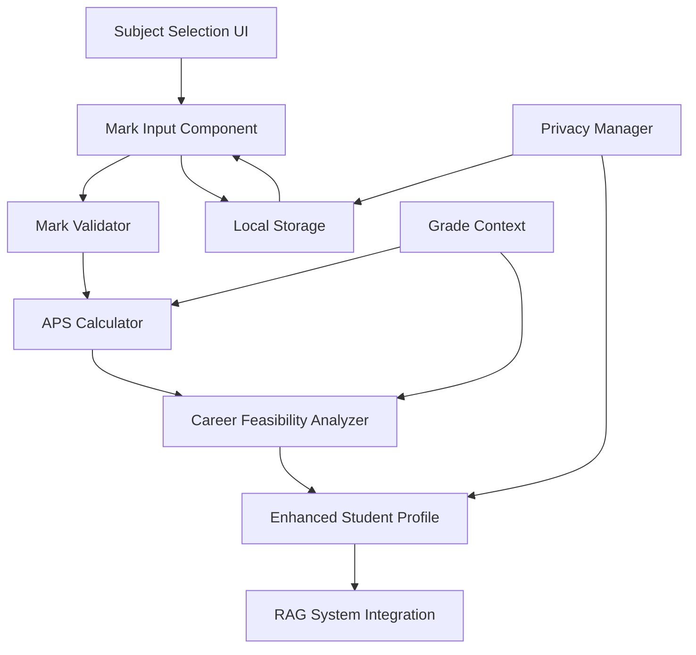

# Subject Marks Collection Enhancement - Design Document

## Overview

This design document outlines the enhancement of the existing subject selection component to collect current academic marks alongside subject preferences. The enhancement transforms the assessment from preference-only to performance-aware, enabling realistic career guidance based on actual academic standing.

The design integrates seamlessly with the existing assessment flow while adding sophisticated mark validation, APS calculation, and privacy-first data handling. The solution maintains backward compatibility and provides graceful fallbacks for incomplete data.

## Architecture

### High-Level Architecture



### Component Integration

The enhancement extends the existing `SubjectSelection` component with:
- **Mark Input Fields**: Dynamic input fields that appear when subjects are selected
- **Real-time Validation**: Immediate feedback on mark validity and format
- **APS Calculator**: Live calculation of university admission scores
- **Privacy Layer**: Local-only storage with automatic cleanup
- **Fallback System**: Graceful handling of incomplete or invalid data

### Data Flow

1. **Subject Selection**: Student selects enjoyed subjects (existing functionality)
2. **Mark Collection**: System prompts for current marks in selected subjects
3. **Validation**: Real-time validation of mark format and range
4. **APS Calculation**: Automatic calculation for Grade 11-12 students
5. **Profile Enhancement**: Integration of marks into student profile
6. **RAG Integration**: Enhanced query context with performance data

## Components and Interfaces

### Enhanced SubjectSelection Component

```javascript
// Enhanced component interface
<SubjectSelection
  selected={formData.enjoyedSubjects}
  marks={formData.subjectMarks}
  onChange={(subjects, marks) => updateFormData(subjects, marks)}
  curriculumProfile={formData.curriculumProfile}
  grade={formData.grade}
  onAPSUpdate={(apsScore) => handleAPSUpdate(apsScore)}
/>
```

### Mark Input Component

```javascript
// Individual mark input component
<MarkInput
  subjectId="mathematics"
  subjectName="Mathematics"
  value={marks.mathematics}
  onChange={(value) => handleMarkChange('mathematics', value)}
  grade={grade}
  validationState="valid|invalid|warning"
  showAPSContribution={true}
/>
```

### Mark Validator Interface

```javascript
class MarkValidator {
  validateMark(mark, format = 'auto') {
    // Returns: { isValid: boolean, normalizedValue: number, errors: string[] }
  }
  
  normalizeToPercentage(mark, format) {
    // Converts symbols (A+, B-, etc.) to percentage equivalents
  }
  
  validateConsistency(marks, subjects) {
    // Checks for unrealistic mark patterns
  }
}
```

### APS Calculator Interface

```javascript
class APSCalculator {
  calculateAPS(marks, grade, curriculumFramework) {
    // Returns: { score: number, breakdown: object, requirements: object }
  }
  
  getUniversityRequirements(careerField) {
    // Returns typical APS requirements for career fields
  }
  
  suggestImprovements(currentAPS, targetAPS) {
    // Returns specific mark improvement targets
  }
}
```

### Privacy Manager Interface

```javascript
class PrivacyManager {
  storeMarksLocally(marks, sessionId) {
    // Stores marks in localStorage with session isolation
  }
  
  clearMarksData(sessionId) {
    // Removes all mark data for session
  }
  
  shouldIncludeInPDF(marks, userConsent) {
    // Determines if marks should be included in PDF export
  }
}
```

## Data Models

### Subject Mark Data Structure

```javascript
const subjectMarks = {
  mathematics: {
    value: 75,
    format: 'percentage', // 'percentage' | 'symbol'
    rawInput: '75%',
    validationState: 'valid',
    lastUpdated: '2024-12-14T10:30:00Z'
  },
  physicalScience: {
    value: 82,
    format: 'symbol',
    rawInput: 'B+',
    validationState: 'valid',
    lastUpdated: '2024-12-14T10:31:00Z'
  }
};
```

### Enhanced Student Profile

```javascript
const enhancedStudentProfile = {
  // Existing fields
  enjoyedSubjects: ['mathematics', 'physicalScience'],
  interests: ['technology', 'problem-solving'],
  
  // New marks-related fields
  academicPerformance: {
    subjectMarks: subjectMarks,
    apsScore: 28,
    apsBreakdown: {
      mathematics: 6,
      physicalScience: 7,
      english: 5,
      // ... other subjects
    },
    performanceLevel: 'above-average', // 'struggling' | 'average' | 'above-average' | 'excellent'
    consistencyScore: 0.85 // 0-1 scale for mark consistency
  },
  
  // Enhanced career feasibility
  careerFeasibility: {
    primaryGoals: {
      engineering: { feasible: true, apsGap: 0, improvementNeeded: false },
      medicine: { feasible: false, apsGap: 8, improvementNeeded: true }
    },
    alternativePathways: ['engineering-technology', 'applied-sciences'],
    improvementTargets: {
      mathematics: { current: 75, target: 80, priority: 'high' }
    }
  }
};
```

### APS Calculation Model

```javascript
const apsCalculation = {
  totalScore: 28,
  maxPossible: 42,
  breakdown: {
    mathematics: { mark: 75, apsPoints: 6 },
    physicalScience: { mark: 82, apsPoints: 7 },
    english: { mark: 68, apsPoints: 5 },
    lifeOrientation: { mark: 78, apsPoints: 6, excludedFromAPS: false },
    // ... other subjects
  },
  universityRequirements: {
    engineering: { typical: 32, competitive: 36 },
    medicine: { typical: 36, competitive: 40 },
    commerce: { typical: 28, competitive: 32 }
  },
  improvementScenarios: [
    {
      description: 'Improve Math to 80%',
      newAPS: 29,
      effort: 'moderate',
      timeframe: 'next term'
    }
  ]
};
```

## Correctness Properties

*A property is a characteristic or behavior that should hold true across all valid executions of a system-essentially, a formal statement about what the system should do. Properties serve as the bridge between human-readable specifications and machine-verifiable correctness guarantees.*

### Property Reflection

After reviewing all properties identified in the prework analysis, I've identified several areas where properties can be consolidated for better testing efficiency:

**Redundancy Elimination:**
- Properties 1.1-1.5 (subject selection and mark prompting) can be combined into a comprehensive subject-mark integration property
- Properties 2.1-2.5 (mark input validation) can be consolidated into a single mark validation property
- Properties 3.1-3.5 (APS calculation) can be combined into a comprehensive APS calculation property
- Properties 6.1-6.5 (UX enhancements) can be consolidated into a single UX behavior property
- Properties 7.1-7.5 (grade-specific interpretation) can be combined into a single grade context property

**Unique Value Properties:**
- Privacy properties (5.1-5.5) remain separate as they test distinct privacy behaviors
- Career feasibility properties (4.1-4.5) remain separate as they test different feasibility scenarios
- Integration properties (8.1-8.5) remain separate as they test different integration aspects
- Fallback properties (9.1-9.5) remain separate as they test different error scenarios

### Core Correctness Properties

**Property 1: Subject-Mark Integration Consistency**
*For any* set of selected subjects, when a subject is added or removed, the mark data should be consistently maintained (added when subject selected, removed when subject deselected) and validation should prevent progression until all selected subjects have valid marks.
**Validates: Requirements 1.1, 1.2, 1.3, 1.4, 1.5**

**Property 2: Mark Input Validation Completeness**
*For any* mark input (percentage 0-100 with decimals, or grade symbols A-F with +/- modifiers), the system should correctly validate, parse, and provide appropriate feedback, maintaining the most recent valid entry when format switches occur.
**Validates: Requirements 2.1, 2.2, 2.3, 2.4, 2.5**

**Property 3: APS Calculation Accuracy**
*For any* valid set of marks for Grade 11-12 students, the APS calculation should be mathematically correct, update in real-time, and provide appropriate context about university requirements and improvement targets.
**Validates: Requirements 3.1, 3.2, 3.3, 3.4, 3.5**

**Property 4: Career Feasibility Analysis**
*For any* combination of marks and stated career interests, the system should provide appropriate feedback (encouraging for aligned marks, improvement strategies for insufficient marks, advanced opportunities for exceeding marks) and handle missing career interests gracefully.
**Validates: Requirements 4.1, 4.2, 4.3, 4.4, 4.5**

**Property 5: Privacy Data Handling**
*For any* mark data entered, the system should store it only locally, use it for guidance without permanent storage, display it only in improvement contexts, include it in PDFs only with explicit consent, and clear it automatically when sessions end.
**Validates: Requirements 5.1, 5.2, 5.3, 5.4, 5.5**

**Property 6: User Experience Consistency**
*For any* mark entry sequence, the system should provide auto-focus progression, immediate visual feedback based on mark quality, consistency validation prompts, summary views when complete, and preserve data during editing.
**Validates: Requirements 6.1, 6.2, 6.3, 6.4, 6.5**

**Property 7: Grade Context Interpretation**
*For any* student grade (10, 11, or 12), the system should interpret marks appropriately for that academic stage (foundation-building for Grade 10, trajectory for Grade 11, admission prospects for Grade 12) and explain the reasoning clearly.
**Validates: Requirements 7.1, 7.2, 7.3, 7.4, 7.5**

**Property 8: Backward Compatibility Integration**
*For any* existing assessment functionality, the enhanced subject selection should maintain all previous features while adding marks collection, pass both subject and mark data forward, integrate with the RAG system, work on mobile devices, and preserve data during navigation.
**Validates: Requirements 8.1, 8.2, 8.3, 8.4, 8.5**

**Property 9: Graceful Fallback Handling**
*For any* incomplete or problematic mark data, the system should offer alternative options ("Don't know", estimates), allow progression with partial data, use available data while noting limitations, request confirmation for suspicious data without blocking, and clearly highlight incomplete fields.
**Validates: Requirements 9.1, 9.2, 9.3, 9.4, 9.5**

## Error Handling

### Validation Error Handling

```javascript
const validationErrors = {
  INVALID_MARK_RANGE: {
    message: 'Marks must be between 0-100% or valid grade symbols (A-F)',
    recovery: 'Clear field and show examples'
  },
  INCONSISTENT_MARKS: {
    message: 'These marks seem inconsistent. Please confirm they are correct.',
    recovery: 'Show confirmation dialog, allow override'
  },
  MISSING_REQUIRED_MARKS: {
    message: 'Please provide marks for all selected subjects to continue.',
    recovery: 'Highlight missing fields, prevent progression'
  }
};
```

### Technical Error Handling

```javascript
const technicalErrors = {
  APS_CALCULATION_FAILED: {
    message: 'Unable to calculate APS score. You can still continue.',
    recovery: 'Hide APS display, log error, continue with basic functionality'
  },
  LOCAL_STORAGE_FAILED: {
    message: 'Unable to save your progress. Please complete in one session.',
    recovery: 'Show warning, continue without persistence'
  },
  CAREER_ANALYSIS_FAILED: {
    message: 'Career analysis temporarily unavailable.',
    recovery: 'Skip career feasibility indicators, continue with basic guidance'
  }
};
```

### Privacy Error Handling

```javascript
const privacyErrors = {
  DATA_CLEANUP_FAILED: {
    message: 'Unable to clear session data automatically.',
    recovery: 'Provide manual clear button, log for monitoring'
  },
  PDF_GENERATION_FAILED: {
    message: 'Unable to include marks in PDF. Generating without marks.',
    recovery: 'Generate PDF without marks, notify user'
  }
};
```

## Testing Strategy

### Dual Testing Approach

The testing strategy employs both unit testing and property-based testing to ensure comprehensive coverage:

**Unit Tests:**
- Specific examples of mark validation (75%, B+, invalid inputs)
- APS calculation examples with known inputs/outputs
- UI interaction examples (subject selection, mark entry)
- Integration points with existing assessment flow

**Property-Based Tests:**
- Universal properties across all valid mark inputs
- Comprehensive validation across all subject combinations
- APS calculation accuracy across all valid mark ranges
- Privacy compliance across all data handling scenarios

### Property-Based Testing Framework

**Framework Selection:** Jest with fast-check for JavaScript property-based testing
**Test Configuration:** Minimum 100 iterations per property test
**Property Test Tagging:** Each test tagged with format: `**Feature: subject-marks-collection, Property {number}: {property_text}**`

### Testing Implementation Requirements

1. **Single Property Implementation:** Each correctness property implemented by exactly one property-based test
2. **Comprehensive Generators:** Smart test data generators that create realistic student profiles, mark combinations, and edge cases
3. **Integration Testing:** Property tests that verify integration with existing StudentProfileBuilder and RAG system
4. **Performance Testing:** Property tests that verify APS calculations complete within performance targets (<2 seconds)
5. **Privacy Testing:** Property tests that verify no mark data persists beyond session boundaries

### Test Data Generation Strategy

```javascript
// Example property test generator
const generateStudentProfile = () => ({
  grade: fc.integer({ min: 10, max: 12 }),
  subjects: fc.array(fc.constantFrom(...VALID_SUBJECTS), { minLength: 2, maxLength: 5 }),
  marks: fc.record({
    mathematics: fc.oneof(
      fc.integer({ min: 0, max: 100 }), // Percentage
      fc.constantFrom('A+', 'A', 'A-', 'B+', 'B', 'B-', 'C+', 'C', 'C-', 'D', 'E', 'F') // Symbols
    )
  })
});
```

### Edge Case Coverage

Property-based tests will automatically generate and test:
- **Boundary Values:** 0%, 100%, grade boundaries (A/B, B/C, etc.)
- **Invalid Inputs:** Negative numbers, >100%, invalid symbols, mixed formats
- **Inconsistent Data:** High marks in unrelated subjects, very low marks in prerequisites
- **Incomplete Data:** Missing marks, partial subject selection, empty fields
- **Grade-Specific Scenarios:** Different behaviors for Grade 10 vs 11 vs 12 students

### Performance and Quality Metrics

**Target Metrics:**
- Property test execution: <5 seconds per property
- APS calculation: <200ms for any valid input
- UI responsiveness: <100ms for mark validation feedback
- Memory usage: <10MB additional for mark data storage
- Test coverage: >95% of mark-related code paths

**Quality Assurance:**
- All property tests must pass 100 iterations without failure
- Integration tests must verify seamless operation with existing assessment flow
- Performance tests must verify response times under various load conditions
- Privacy tests must verify complete data cleanup in all scenarios