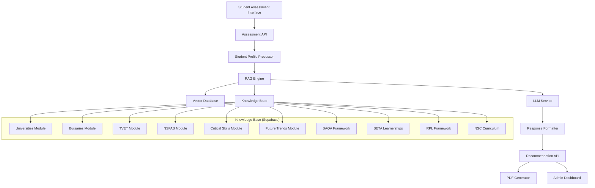

# Design Document

## Overview

The Thandi RAG System is a retrieval-augmented generation engine that processes student career assessment responses and provides personalized career recommendations. The system leverages 10 knowledge modules containing South African educational and career data to generate contextually relevant advice that addresses student constraints, interests, and academic strengths.

## Architecture

### High-Level Architecture



### Technology Stack

- **Frontend**: React (mobile-first, Progressive Web App)
- **Backend**: Node.js with Express
- **Database**: Supabase (PostgreSQL with pgvector extension)
- **Vector Database**: Supabase pgvector (embedded in main database)
- **LLM Service**: OpenAI GPT-4 (with fallback to GPT-3.5-turbo)
- **Hosting**: Vercel
- **File Storage**: Supabase Storage (for PDFs)
- **Offline Storage**: localStorage for assessment questions and responses

## Components and Interfaces

### 1. Assessment Module

**Purpose**: Captures student responses to 15-20 career assessment questions

**Key Components**:
- Question renderer with progress tracking
- Offline response storage (localStorage with sync)
- Mobile-optimized UI for 4-inch screens
- Dropout prevention (save progress, resume later)

**API Endpoints**:
```
POST /api/assessment/start - Initialize new assessment session
POST /api/assessment/save-progress - Save partial responses
POST /api/assessment/submit - Submit completed assessment
GET /api/assessment/resume/:sessionId - Resume incomplete assessment
```

### 2. RAG Engine

**Purpose**: Core recommendation generation using retrieval-augmented generation

**Key Components**:
- **Query Processor**: Converts student profile to search queries
- **Retrieval System**: Semantic search across knowledge modules
- **Context Assembler**: Combines retrieved content with student profile
- **LLM Interface**: Generates personalized recommendations
- **Quality Filter**: Ensures 18/20 test pass rate compliance

**Processing Flow**:
1. Student profile → Multiple targeted queries
2. Semantic search across 10 knowledge modules
3. Retrieve top-k relevant chunks per module
4. Assemble context with student constraints
5. Generate 3-5 career recommendations with reasoning
6. Format response with bursaries, next steps, salary data

### 3. Knowledge Base Manager

**Purpose**: Manages 10 structured knowledge modules in Supabase

**Database Schema**:
```sql
-- Enable pgvector extension
CREATE EXTENSION IF NOT EXISTS vector;

-- Knowledge modules (10 modules as specified)
CREATE TABLE knowledge_modules (
    id UUID PRIMARY KEY DEFAULT gen_random_uuid(),
    module_name VARCHAR(50) NOT NULL UNIQUE,
    description TEXT,
    priority INTEGER DEFAULT 1, -- For Sprint 1-2: modules 1,2,3,6,7 = priority 1
    last_updated TIMESTAMP DEFAULT NOW(),
    version INTEGER DEFAULT 1
);

-- Structured knowledge data (universities, bursaries, careers)
CREATE TABLE structured_knowledge (
    id UUID PRIMARY KEY DEFAULT gen_random_uuid(),
    module_id UUID REFERENCES knowledge_modules(id),
    entity_type VARCHAR(50) NOT NULL, -- 'university', 'bursary', 'career'
    entity_key VARCHAR(100) NOT NULL, -- 'uct', 'sasol_bursary', 'data_scientist'
    data JSONB NOT NULL, -- All structured fields
    searchable_text TEXT, -- For keyword search
    created_at TIMESTAMP DEFAULT NOW()
);

-- Text chunks for RAG (from ideal answers + knowledge base)
CREATE TABLE knowledge_chunks (
    id UUID PRIMARY KEY DEFAULT gen_random_uuid(),
    module_id UUID REFERENCES knowledge_modules(id),
    chunk_text TEXT NOT NULL,
    chunk_metadata JSONB, -- Source, tags, categories
    embedding vector(1536), -- OpenAI ada-002 embeddings
    created_at TIMESTAMP DEFAULT NOW()
);

-- Student assessments
CREATE TABLE student_assessments (
    id UUID PRIMARY KEY DEFAULT gen_random_uuid(),
    school_id UUID NOT NULL,
    student_id VARCHAR(50) NOT NULL,
    assessment_data JSONB NOT NULL, -- All 15-20 responses
    student_profile JSONB, -- Processed profile for RAG
    completed_at TIMESTAMP DEFAULT NOW(),
    status VARCHAR(20) DEFAULT 'completed' -- 'completed', 'processing', 'failed'
);

-- Generated recommendations (cached)
CREATE TABLE recommendations (
    id UUID PRIMARY KEY DEFAULT gen_random_uuid(),
    assessment_id UUID REFERENCES student_assessments(id),
    recommendations JSONB NOT NULL, -- Array of 3-5 career matches
    generation_metadata JSONB, -- Model used, processing time, etc.
    created_at TIMESTAMP DEFAULT NOW()
);

-- Test suite tracking
CREATE TABLE test_results (
    id UUID PRIMARY KEY DEFAULT gen_random_uuid(),
    test_question_id VARCHAR(10) NOT NULL, -- 'Q1', 'Q2', etc.
    test_input TEXT NOT NULL,
    expected_output TEXT NOT NULL, -- Ideal answer
    actual_output TEXT,
    pass_score DECIMAL(3,2), -- 0.0 to 1.0
    passed BOOLEAN,
    test_run_id UUID, -- Group tests by run
    created_at TIMESTAMP DEFAULT NOW()
);

-- Indexes for performance
CREATE INDEX idx_knowledge_chunks_embedding ON knowledge_chunks USING ivfflat (embedding vector_cosine_ops);
CREATE INDEX idx_structured_knowledge_type ON structured_knowledge(entity_type);
CREATE INDEX idx_structured_knowledge_module ON structured_knowledge(module_id);
CREATE INDEX idx_assessments_school ON student_assessments(school_id);
```

### 4. Vector Search System

**Purpose**: Semantic search across knowledge content using embeddings

**Implementation**:
- **Embedding Model**: OpenAI text-embedding-ada-002
- **Vector Storage**: Chroma in embedded mode (file-based for Vercel)
- **Search Strategy**: Hybrid search (semantic + keyword matching)
- **Chunking Strategy**: 500-token chunks with 50-token overlap

**Search Process**:
1. Convert student profile to embedding
2. Search each knowledge module separately
3. Retrieve top-3 chunks per module (30 total)
4. Re-rank by relevance to student constraints
5. Select final 10-15 chunks for context

### 5. Response Generation System

**Purpose**: Generate contextually appropriate career recommendations

**Prompt Engineering Strategy**:
```
System: You are Thandi, an AI career counselor for South African high school students...

Context: [Retrieved knowledge chunks]

Student Profile:
- Academic strengths: {subjects}
- Interests: {interests}
- Financial constraints: {financial_status}
- Career awareness: {career_knowledge}
- Values: {values}

Task: Generate exactly 3-5 career recommendations that:
1. Match student's academic strengths
2. Address financial constraints with specific bursary options
3. Include salary ranges and next steps
4. Reference South African context (universities, companies, market demand)
5. Pass the quality criteria from the 20-question test suite
```

## Data Models

### Student Profile Model
```typescript
interface StudentProfile {
  academicStrengths: string[]; // ['mathematics', 'physical_science']
  interests: string[]; // ['problem_solving', 'technology']
  values: string[]; // ['financial_security', 'helping_others']
  constraints: {
    financial: 'low' | 'medium' | 'high';
    location: string; // Province
    timeCommitment: 'full_time' | 'part_time';
  };
  careerAwareness: 'low' | 'medium' | 'high';
  subjectCombination: string[]; // Current matric subjects
}
```

### Career Recommendation Model
```typescript
interface CareerRecommendation {
  title: string;
  matchPercentage: number; // 85-95%
  description: string; // 2-sentence overview
  reasoning: string; // Why this matches student
  requirements: {
    subjects: string[];
    minimumMarks: Record<string, number>;
    studyPath: string; // Degree/diploma name
    duration: string; // "3 years"
  };
  financialInfo: {
    studyCost: string; // "R40K-R60K/year"
    startingSalary: string; // "R18K-R30K/month"
    bursaries: BursaryOption[];
  };
  nextSteps: string[]; // Actionable steps
  marketOutlook: string; // Job demand, growth prospects
}
```

### Bursary Option Model
```typescript
interface BursaryOption {
  name: string; // "Sasol Engineering Bursary"
  provider: string; // "Sasol"
  amount: string; // "Full tuition + R5K/month"
  deadline: string; // "30 June 2026"
  requirements: string[]; // ["70%+ Mathematics", "SA Citizen"]
  applicationUrl: string;
}
```

## Error Handling

### Graceful Degradation Strategy

1. **LLM Service Failure**:
   - Fallback to cached recommendations for similar profiles
   - Display generic career paths based on subject combination
   - Show error message with retry option

2. **Vector Search Failure**:
   - Fallback to keyword-based search in knowledge base
   - Use pre-computed recommendations for common profiles
   - Reduce recommendation quality but maintain functionality

3. **Knowledge Base Unavailable**:
   - Serve from local cache (last 24 hours of data)
   - Display warning about potentially outdated information
   - Queue requests for retry when service restored

4. **Rate Limiting (OpenAI)**:
   - Implement exponential backoff
   - Queue requests during peak usage
   - Use GPT-3.5-turbo as fallback for cost efficiency

### Error Response Format
```typescript
interface ErrorResponse {
  success: false;
  error: {
    code: string; // 'LLM_UNAVAILABLE', 'RATE_LIMITED', etc.
    message: string; // User-friendly message
    fallbackAvailable: boolean;
    retryAfter?: number; // Seconds
  };
}
```

## Testing Strategy

### 1. 20-Question Test Suite Validation

**Automated Testing**:
- Run all 20 test questions through RAG system
- Compare outputs against ideal answers using semantic similarity
- Require 18/20 pass rate (90%) before deployment
- Track performance metrics per question category

**Test Categories**:
- Subject-Career Matching (Q1-Q5): 100% pass required
- Financial Constraints (Q6-Q10): 90% pass required  
- Career Misconceptions (Q11-Q15): 85% pass required
- 4IR/Emerging Careers (Q16-Q18): 90% pass required
- Decision-Making Process (Q19-Q20): 85% pass required

### 2. Performance Testing

**Load Testing**:
- Simulate 500 concurrent students (3 schools × 200 students)
- Test assessment completion under load
- Validate 10-second recommendation generation SLA
- Monitor Supabase connection limits

**Mobile Performance Testing**:
- Test on 4-inch Android devices
- Validate 3-second load time on 3G networks
- Test offline functionality and sync
- Verify UI responsiveness on slow devices

### 3. Integration Testing

**Knowledge Base Integration**:
- Validate all 10 modules load correctly
- Test embedding generation and search
- Verify data consistency across modules
- Test knowledge base updates without downtime

**API Integration Testing**:
- Test all endpoints with various input combinations
- Validate error handling and fallback mechanisms
- Test rate limiting and queue management
- Verify POPIA compliance in data handling

## Performance Optimization

### 1. Caching Strategy

**Multi-Level Caching**:
- **L1 Cache**: In-memory LRU cache for frequent queries (Redis alternative)
- **L2 Cache**: Supabase cached queries for knowledge content
- **L3 Cache**: Pre-computed recommendations for common profiles

**Cache Invalidation**:
- Knowledge base updates trigger cache refresh
- Student profile changes invalidate recommendation cache
- Time-based expiry for market data (salaries, bursaries)

### 2. Database Optimization

**Query Optimization**:
- Index on frequently searched fields (module_name, content_key)
- Partition knowledge_content by module for faster searches
- Use JSONB indexes for structured data queries
- Implement connection pooling for concurrent access

**Storage Optimization**:
- Compress text content before storage
- Use JSONB for structured data (better than TEXT)
- Archive old assessments after 2 years
- Monitor 500MB Supabase limit with alerts at 80%

### 3. API Performance

**Response Optimization**:
- Compress API responses (gzip)
- Implement request batching for multiple operations
- Use streaming responses for large recommendation sets
- Minimize payload size for mobile clients

**Concurrent Processing**:
- Parallel knowledge module searches
- Async LLM calls with timeout handling
- Background processing for non-critical operations
- Queue system for high-load periods

## Security and Compliance

### POPIA Compliance

**Data Protection Measures**:
- Encrypt student data at rest (Supabase encryption)
- Use UUIDs instead of sequential IDs
- Implement data retention policies (delete after 7 years)
- Provide data export/deletion on request

**Access Controls**:
- Role-based access (student, counselor, admin)
- School-level data isolation
- API key authentication for external access
- Audit logging for all data access

### Security Best Practices

**API Security**:
- Rate limiting per IP and user
- Input validation and sanitization
- SQL injection prevention (parameterized queries)
- CORS configuration for frontend domains only

**Infrastructure Security**:
- Environment variables for all secrets
- HTTPS enforcement
- Regular dependency updates
- Vulnerability scanning in CI/CD

## Deployment and Monitoring

### Deployment Strategy

**Vercel Configuration**:
- Serverless functions for API endpoints
- Static site generation for frontend
- Environment-based configuration (dev/staging/prod)
- Automatic deployments from main branch

**Database Migration**:
- Version-controlled schema migrations
- Seed data for knowledge modules
- Backup strategy before major updates
- Rollback procedures for failed deployments

### Monitoring and Alerting

**Key Metrics**:
- Assessment completion rate (target: >70%)
- Recommendation generation time (target: <10s)
- API error rates (target: <1%)
- Database query performance
- Supabase storage usage (alert at 80% of 500MB)

**Alerting Thresholds**:
- Response time >15 seconds
- Error rate >5% over 5 minutes
- Database connection failures
- LLM service unavailability
- Storage approaching limits

**Health Checks**:
- API endpoint availability
- Database connectivity
- Knowledge base integrity
- Vector search functionality
- LLM service status